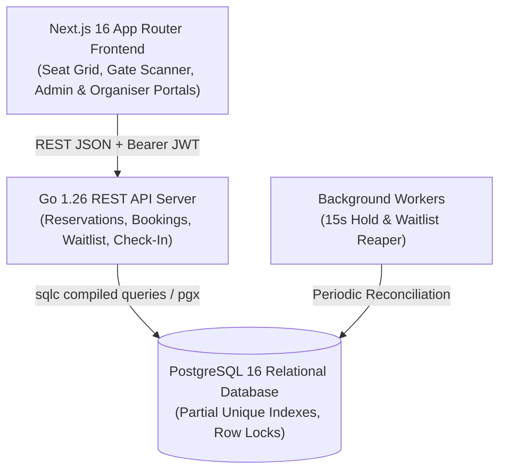

# VelvetSeats: High-Concurrency Ticket Booking and Event Management System

VelvetSeats is a high-concurrency ticket booking and live event management platform engineered with Go 1.26, PostgreSQL 16 (using strict partial unique indexes and `sqlc` compiled queries), and Next.js 16 (App Router with Tailwind CSS).

The platform guarantees zero double-bookings, atomic 10-minute seat holds with automatic TTL expiration, and deterministic first-in, first-out (FIFO) waitlist reallocations with time-limited claim offers.

---

## Architectural Overview



---

## Technical Documentation Index

Detailed architectural and operational documentation is available in the `docs/` directory:

- **System Design Write-Up**: [`docs/system_design.md`](docs/system_design.md): Architectural overview, concurrency models, and failure recovery.
- **REST API Reference**: [`docs/api_reference.md`](docs/api_reference.md): Complete endpoint catalog, request/response schemas, status codes, and RBAC rules.
- **Database Schema Reference**: [`docs/database_schema.md`](docs/database_schema.md): Relational schema, column definitions, constraints, and partial unique indexes.
- **Concurrency & Waitlist Mechanics**: [`docs/concurrency_and_waitlist.md`](docs/concurrency_and_waitlist.md): Mathematical state transitions, CAS hold protocol, and FIFO queue algorithms.

---

## Core Capabilities by Role

### 1. Customer (Fan)
- **Event Catalog**: Search and browse live events by city and category.
- **Interactive Seat Map**: Real-time visual 2D seating grid with live status synchronization across concurrent users.
- **Atomic 10-Minute Seat Holds**: Temporary reservation with countdown timer and automated abandonment release.
- **Digital Passes**: Immediate generation of scannable QR ticket passes and simulated email delivery.
- **Self-Service Cancellation**: Instant cancellation initiating automatic FIFO seat reallocation.
- **FIFO Waitlist Queue**: Queue position tracking (`#1 in Queue`) and time-limited offer claim flows (`/waitlist/offer?token=...&event=...`).

### 2. Event Organiser
- **Event Listing Management**: Event creation with venue selection, hold TTL settings, and per-category pricing tiers (VIP, Premium, Standard).
- **Marketplace Publishing**: Draft to live publishing and event cancellation workflows.
- **Real-Time Analytics**: Live occupancy rates, gross revenue calculations, category sales breakdowns, and waitlist demand metrics.
- **Gate Check-In Scanner**: Turnstile ticket inspection with cryptographic validation and anti-replay duplicate check-in protection.

### 3. Platform Administrator
- **Venue Management**: Full CRUD for physical venues, stadiums, and cinema auditoriums.
- **Seat Category Management**: Tier definitions and custom color code assignments.
- **Visual Layout Configurator**: Interactive grid builder supporting custom matrix dimensions, row tier assignment, active/inactive seat toggling, and batch database deployment.

---

## Concurrency Guarantees

1. **Zero Double-Bookings**: Enforced via PostgreSQL partial unique index `uq_event_seat_booked (event_id, venue_seat_id) WHERE status = 'BOOKED'`.
2. **Mutual Exclusion of Active Holds**: Enforced via partial unique index `uq_event_seat_active_hold_offer (event_id, venue_seat_id) WHERE status IN ('HELD', 'OFFERED')`.
3. **Atomic Compare-And-Swap (CAS)**: Conditional updates ensure holds succeed only if all target seats remain in `AVAILABLE` status.
4. **Non-Blocking FIFO Queue Selection**: Waitlist candidates are selected using `SELECT ... FOR UPDATE SKIP LOCKED` ordered by `created_at ASC`.

---

## Development Environment & Setup

### Prerequisites
- **Nix Flake** (recommended) or native Go 1.26, Node.js 24+, and PostgreSQL 16.
- **Docker & Docker Compose** (for local PostgreSQL and Mailpit).

### 1. Clone Repository & Enter Dev Environment
```bash
git clone <repository-url> ticket-booking
cd ticket-booking

# Enter the isolated Nix development environment
nix develop
```

### 2. Start PostgreSQL and Mailpit
```bash
docker-compose up -d
```
- PostgreSQL: `localhost:5432` (User: `postgres`, Password: `postgres`, Database: `ticket_booking`)
- Mailpit Web Interface: `http://localhost:8025` (SMTP: `localhost:1025`)

### 3. Apply Database Migrations
```bash
cd backend
go run cmd/migrate/main.go up
```

### 4. Start the Backend API Server
```bash
cd backend
go run cmd/server/main.go
```
The REST API server will listen on `http://localhost:8080`.

### 5. Start the Next.js Frontend
```bash
cd frontend
npm install
npm run dev
```
The web application will be accessible at `http://localhost:3000`.

---

## Test Suite Execution

### Backend Unit & Integration Tests
```bash
nix develop --command bash -c "cd backend && go test -v ./..."
```

### Frontend Production Build & Type Checking
```bash
nix develop --command bash -c "cd frontend && npm run build"
```

---

## Environment Variables

Templates are provided for development and production configurations:
- Root Template: `.env.example`
- Backend Configuration: `backend/.env.example`
- Frontend Configuration: `frontend/.env.example`
