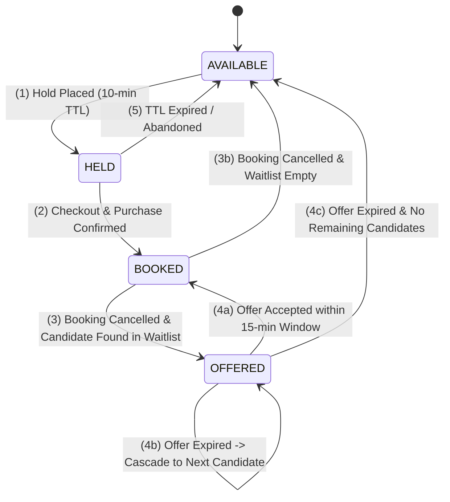

# Concurrency Control & FIFO Waitlist Mechanics

This document provides a formal breakdown of the concurrency guarantees, state machines, TTL reconciliation engines, and FIFO waitlist reallocation algorithms implemented in VelvetSeats.

---

## 1. Seat State Machine

Every seat in an event transitions through the following discrete state lifecycle:



### State Definitions
1. `AVAILABLE`: Seat is open for reservation by any authenticated user.
2. `HELD`: Seat is reserved exclusively by a customer with an active TTL timer ($T \le 10\text{ minutes}$).
3. `BOOKED`: Seat has been paid for and issued as a ticket.
4. `OFFERED`: Seat has been temporarily assigned to the top candidate in the FIFO waitlist with an expiration deadline ($T \le 15\text{ minutes}$).

---

## 2. Concurrency Invariants & Isolation Levels

### Invariant 1: Single Occupancy Invariant
$$\forall s \in \text{Seats}(E), \quad \sum \mathbb{I}(\text{status}(s) \in \{\text{BOOKED}\}) \le 1$$

Enforced via PostgreSQL partial unique index:
```sql
CREATE UNIQUE INDEX uq_event_seat_booked 
ON event_seats (event_id, venue_seat_id) 
WHERE status = 'BOOKED';
```

### Invariant 2: Mutual Exclusion of Active Claims
$$\forall s \in \text{Seats}(E), \quad \sum \mathbb{I}(\text{status}(s) \in \{\text{HELD}, \text{OFFERED}\}) \le 1$$

Enforced via PostgreSQL partial unique index:
```sql
CREATE UNIQUE INDEX uq_event_seat_active_hold_offer 
ON event_seats (event_id, venue_seat_id) 
WHERE status IN ('HELD', 'OFFERED');
```

---

## 3. Atomic Seat Hold Protocol (Compare-And-Swap)

When a customer attempts to hold a set of seats $S = \{s_1, s_2, \dots, s_k\}$ for an event $E$:

1. A unique UUID `hold_token` is generated.
2. Expiration timestamp is computed: $t_{\text{expire}} = \text{NOW}() + \text{TTL}$.
3. An atomic conditional update is executed:
```sql
UPDATE event_seats
SET status = 'HELD',
    hold_token = $hold_token,
    hold_expires_at = $t_expire,
    held_by_user_id = $user_id
WHERE event_id = $event_id
  AND id = ANY($seat_ids)
  AND status = 'AVAILABLE';
```
4. The database driver returns `rows_affected`.
   - If $\text{rows\_affected} == |S|$, all seats were successfully captured. The transaction commits.
   - If $\text{rows\_affected} < |S|$, one or more seats were claimed by a concurrent transaction. The transaction immediately rolls back and returns HTTP `409 Conflict`.

---

## 4. Background TTL Reconciliation Engine

Two background ticker routines run every 15 seconds to enforce expiration semantics:

### Routine 1: Hold Expiration Reaper
Releases abandoned holds whose expiration timestamp has passed:
```sql
UPDATE event_seats
SET status = 'AVAILABLE',
    hold_token = NULL,
    hold_expires_at = NULL,
    held_by_user_id = NULL
WHERE status = 'HELD'
  AND hold_expires_at < NOW();
```

### Routine 2: Stale Waitlist Offer Reaper & Cascade Trigger
Finds offered seats whose claim window expired without customer action:
1. Identifies expired waitlist entries:
```sql
SELECT id, event_id, seat_category_id, event_seat_id 
FROM waitlist_entries
WHERE status = 'OFFERED' 
  AND offer_expires_at < NOW()
FOR UPDATE SKIP LOCKED;
```
2. Transitions the entry to `EXPIRED`.
3. Invokes `ReallocateCancelledSeat` on the `event_seat_id` to immediately offer the seat to the next waiting customer.

---

## 5. FIFO Waitlist Reallocation Algorithm

When a booking is cancelled or an offer expires:

```
Algorithm: ReallocateCancelledSeat(event_id, seat_id, category_id)
1. BEGIN TRANSACTION
2. candidate := SELECT * FROM waitlist_entries
                WHERE event_id = event_id 
                  AND seat_category_id = category_id 
                  AND status = 'WAITING'
                ORDER BY created_at ASC
                LIMIT 1
                FOR UPDATE SKIP LOCKED;
3. IF candidate IS NULL THEN
     UPDATE event_seats 
     SET status = 'AVAILABLE', hold_token = NULL, hold_expires_at = NULL, held_by_user_id = NULL
     WHERE id = seat_id;
     COMMIT;
     RETURN;
   END IF;
4. token := gen_random_uuid()
5. expiry := NOW() + 15 minutes
6. UPDATE event_seats
   SET status = 'OFFERED', hold_token = token, hold_expires_at = expiry, held_by_user_id = candidate.user_id
   WHERE id = seat_id;
7. UPDATE waitlist_entries
   SET status = 'OFFERED', offer_token = token, offer_expires_at = expiry, event_seat_id = seat_id
   WHERE id = candidate.id;
8. COMMIT;
9. ASYNC: Dispatch notification email with URL: /waitlist/offer?token={token}&event={event_id}
```

The use of `FOR UPDATE SKIP LOCKED` guarantees that concurrent cancellation events never compete for or double-assign the same waitlisted customer.
