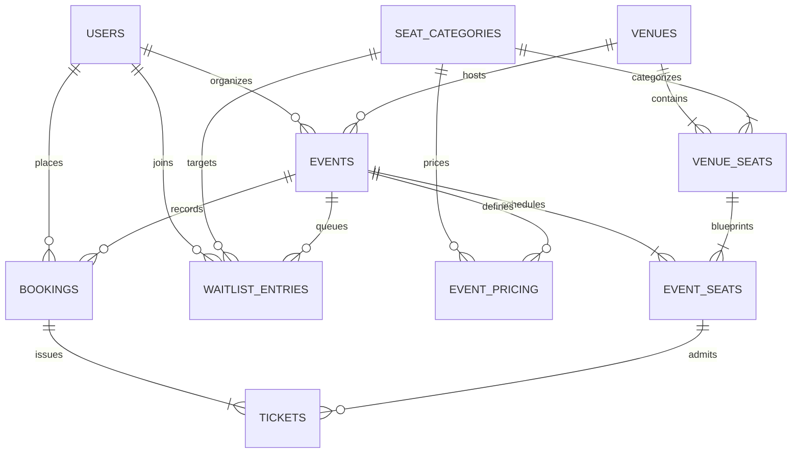

# VelvetSeats Database Schema & Constraint Reference

This document outlines the PostgreSQL 16 relational database schema, indexing strategies, partial unique constraints, and foreign key relationships.

---

## Entity Relationship Overview



---

## Tables & Columns

### 1. `users`
Stores user identities, credentials, and role permissions.

| Column | Type | Constraints | Description |
| :--- | :--- | :--- | :--- |
| `id` | `UUID` | `PRIMARY KEY DEFAULT gen_random_uuid()` | Unique user identifier |
| `email` | `VARCHAR(255)` | `NOT NULL UNIQUE` | Normalized user email |
| `password_hash` | `VARCHAR(255)` | `NOT NULL` | bcrypt password hash |
| `full_name` | `VARCHAR(255)` | `NOT NULL` | Display name |
| `phone` | `VARCHAR(50)` | `NULL` | Optional contact number |
| `role` | `VARCHAR(50)` | `NOT NULL DEFAULT 'CUSTOMER'` | `CUSTOMER`, `ORGANISER`, or `ADMIN` |
| `created_at` | `TIMESTAMPTZ` | `NOT NULL DEFAULT NOW()` | Record creation timestamp |
| `updated_at` | `TIMESTAMPTZ` | `NOT NULL DEFAULT NOW()` | Record last update timestamp |

---

### 2. `venues`
Physical auditoriums, stadiums, and performance halls.

| Column | Type | Constraints | Description |
| :--- | :--- | :--- | :--- |
| `id` | `UUID` | `PRIMARY KEY DEFAULT gen_random_uuid()` | Venue identifier |
| `name` | `VARCHAR(255)` | `NOT NULL` | Venue name |
| `address` | `VARCHAR(500)` | `NOT NULL` | Street address |
| `city` | `VARCHAR(100)` | `NOT NULL` | City name |
| `state` | `VARCHAR(100)` | `NULL` | State or province |
| `country` | `VARCHAR(100)` | `NOT NULL DEFAULT 'US'` | ISO country code |
| `total_capacity` | `INTEGER` | `NOT NULL DEFAULT 0` | Active seat capacity |
| `created_at` | `TIMESTAMPTZ` | `NOT NULL DEFAULT NOW()` | Record creation timestamp |
| `updated_at` | `TIMESTAMPTZ` | `NOT NULL DEFAULT NOW()` | Record last update timestamp |

---

### 3. `seat_categories`
Platform seating tiers (e.g. VIP, Premium, Standard).

| Column | Type | Constraints | Description |
| :--- | :--- | :--- | :--- |
| `id` | `UUID` | `PRIMARY KEY DEFAULT gen_random_uuid()` | Category identifier |
| `name` | `VARCHAR(100)` | `NOT NULL UNIQUE` | Category title |
| `description` | `TEXT` | `NULL` | Optional tier amenity details |
| `color_code` | `VARCHAR(20)` | `NOT NULL DEFAULT '#3B82F6'` | Hex color code for UI rendering |
| `created_at` | `TIMESTAMPTZ` | `NOT NULL DEFAULT NOW()` | Record creation timestamp |
| `updated_at` | `TIMESTAMPTZ` | `NOT NULL DEFAULT NOW()` | Record last update timestamp |

---

### 4. `venue_seats`
Static physical seat layout definition for a venue.

| Column | Type | Constraints | Description |
| :--- | :--- | :--- | :--- |
| `id` | `UUID` | `PRIMARY KEY DEFAULT gen_random_uuid()` | Seat identifier |
| `venue_id` | `UUID` | `NOT NULL REFERENCES venues(id) ON DELETE CASCADE` | Associated venue |
| `seat_category_id` | `UUID` | `NOT NULL REFERENCES seat_categories(id)` | Default seat category |
| `row_label` | `VARCHAR(10)` | `NOT NULL` | Row identifier (e.g. "A", "B") |
| `seat_number` | `VARCHAR(10)` | `NOT NULL` | Seat number within row (e.g. "1", "2") |
| `grid_row` | `INTEGER` | `NOT NULL` | 2D matrix row index for rendering |
| `grid_col` | `INTEGER` | `NOT NULL` | 2D matrix column index for rendering |
| `is_active` | `BOOLEAN` | `NOT NULL DEFAULT TRUE` | Whether seat is bookable or an aisle/pillar |
| `created_at` | `TIMESTAMPTZ` | `NOT NULL DEFAULT NOW()` | Record creation timestamp |

- **Unique Constraints**:
  - `UNIQUE (venue_id, row_label, seat_number)`
  - `UNIQUE (venue_id, grid_row, grid_col)`

---

### 5. `events`
Performances, screenings, and matches scheduled at a venue.

| Column | Type | Constraints | Description |
| :--- | :--- | :--- | :--- |
| `id` | `UUID` | `PRIMARY KEY DEFAULT gen_random_uuid()` | Event identifier |
| `venue_id` | `UUID` | `NOT NULL REFERENCES venues(id)` | Venue location |
| `organised_by` | `UUID` | `NOT NULL REFERENCES users(id)` | Creator organiser |
| `title` | `VARCHAR(255)` | `NOT NULL` | Event title |
| `description` | `TEXT` | `NULL` | Event overview |
| `poster_url` | `VARCHAR(1000)` | `NULL` | Promotional banner URL |
| `event_type` | `VARCHAR(50)` | `NOT NULL DEFAULT 'CONCERT'` | `CONCERT`, `MOVIE`, `THEATRE`, `SPORTS` |
| `start_time` | `TIMESTAMPTZ` | `NOT NULL` | Showtime start timestamp |
| `end_time` | `TIMESTAMPTZ` | `NOT NULL` | Showtime end timestamp |
| `status` | `VARCHAR(50)` | `NOT NULL DEFAULT 'DRAFT'` | `DRAFT`, `PUBLISHED`, `CANCELLED`, `COMPLETED` |
| `hold_ttl_seconds` | `INTEGER` | `NOT NULL DEFAULT 600` | Seat hold duration (seconds) |
| `created_at` | `TIMESTAMPTZ` | `NOT NULL DEFAULT NOW()` | Record creation timestamp |
| `updated_at` | `TIMESTAMPTZ` | `NOT NULL DEFAULT NOW()` | Record last update timestamp |

---

### 6. `event_pricing`
Per-event price assignments for each seat category.

| Column | Type | Constraints | Description |
| :--- | :--- | :--- | :--- |
| `id` | `UUID` | `PRIMARY KEY DEFAULT gen_random_uuid()` | Pricing record identifier |
| `event_id` | `UUID` | `NOT NULL REFERENCES events(id) ON DELETE CASCADE` | Associated event |
| `seat_category_id` | `UUID` | `NOT NULL REFERENCES seat_categories(id)` | Category |
| `price` | `NUMERIC(10,2)` | `NOT NULL` | Base seat price |
| `currency` | `VARCHAR(10)` | `NOT NULL DEFAULT 'USD'` | Currency code |
| `created_at` | `TIMESTAMPTZ` | `NOT NULL DEFAULT NOW()` | Record creation timestamp |

- **Unique Constraint**: `UNIQUE (event_id, seat_category_id)`

---

### 7. `event_seats`
Per-event instance of every physical seat tracking live status, holds, and booking assignments.

| Column | Type | Constraints | Description |
| :--- | :--- | :--- | :--- |
| `id` | `UUID` | `PRIMARY KEY DEFAULT gen_random_uuid()` | Event seat instance identifier |
| `event_id` | `UUID` | `NOT NULL REFERENCES events(id) ON DELETE CASCADE` | Associated event |
| `venue_seat_id` | `UUID` | `NOT NULL REFERENCES venue_seats(id)` | Physical seat blueprint |
| `status` | `VARCHAR(50)` | `NOT NULL DEFAULT 'AVAILABLE'` | `AVAILABLE`, `HELD`, `OFFERED`, `BOOKED` |
| `hold_token` | `UUID` | `NULL` | Unique token of active hold or offer |
| `hold_expires_at` | `TIMESTAMPTZ` | `NULL` | Hold or offer expiration timestamp |
| `held_by_user_id` | `UUID` | `NULL REFERENCES users(id)` | User holding or offered the seat |
| `created_at` | `TIMESTAMPTZ` | `NOT NULL DEFAULT NOW()` | Record creation timestamp |
| `updated_at` | `TIMESTAMPTZ` | `NOT NULL DEFAULT NOW()` | Record last update timestamp |

---

## Partial Unique Indexes (Concurrency Guarantees)

PostgreSQL partial unique indexes ensure that conflicting state transitions are impossible:

```sql
-- 1. Enforce that a seat can only be actively booked once per event
CREATE UNIQUE INDEX uq_event_seat_booked 
ON event_seats (event_id, venue_seat_id) 
WHERE status = 'BOOKED';

-- 2. Enforce that a seat cannot have multiple active holds or pending offers
CREATE UNIQUE INDEX uq_event_seat_active_hold_offer 
ON event_seats (event_id, venue_seat_id) 
WHERE status IN ('HELD', 'OFFERED');
```

---

### 8. `bookings`
Completed ticket purchases and orders.

| Column | Type | Constraints | Description |
| :--- | :--- | :--- | :--- |
| `id` | `UUID` | `PRIMARY KEY DEFAULT gen_random_uuid()` | Booking identifier |
| `booking_reference` | `VARCHAR(50)` | `NOT NULL UNIQUE` | Public reference (e.g. `BK-20260823-7891`) |
| `event_id` | `UUID` | `NOT NULL REFERENCES events(id)` | Associated event |
| `customer_id` | `UUID` | `NOT NULL REFERENCES users(id)` | Booking customer |
| `status` | `VARCHAR(50)` | `NOT NULL DEFAULT 'CONFIRMED'` | `CONFIRMED`, `CANCELLED`, `REFUNDED` |
| `total_amount` | `NUMERIC(10,2)` | `NOT NULL` | Total order amount paid |
| `currency` | `VARCHAR(10)` | `NOT NULL DEFAULT 'USD'` | Currency code |
| `payment_reference` | `VARCHAR(100)` | `NULL` | Payment gateway transaction ID |
| `created_at` | `TIMESTAMPTZ` | `NOT NULL DEFAULT NOW()` | Order placement timestamp |
| `updated_at` | `TIMESTAMPTZ` | `NOT NULL DEFAULT NOW()` | Order update timestamp |

---

### 9. `tickets`
Digital passes issued for admission.

| Column | Type | Constraints | Description |
| :--- | :--- | :--- | :--- |
| `id` | `UUID` | `PRIMARY KEY DEFAULT gen_random_uuid()` | Ticket identifier |
| `booking_id` | `UUID` | `NOT NULL REFERENCES bookings(id) ON DELETE CASCADE` | Order |
| `event_seat_id` | `UUID` | `NOT NULL REFERENCES event_seats(id)` | Seat allocation |
| `qr_code_payload` | `VARCHAR(500)` | `NOT NULL UNIQUE` | Cryptographic barcode string |
| `is_checked_in` | `BOOLEAN` | `NOT NULL DEFAULT FALSE` | Turnstile admission status |
| `checked_in_at` | `TIMESTAMPTZ` | `NULL` | Gate check-in timestamp |
| `checked_in_by` | `UUID` | `NULL REFERENCES users(id)` | Gate operator |
| `status` | `VARCHAR(50)` | `NOT NULL DEFAULT 'VALID'` | `VALID`, `CANCELLED`, `VOID` |
| `created_at` | `TIMESTAMPTZ` | `NOT NULL DEFAULT NOW()` | Record creation timestamp |

---

### 10. `waitlist_entries`
FIFO waitlist queue for sold-out event categories.

| Column | Type | Constraints | Description |
| :--- | :--- | :--- | :--- |
| `id` | `UUID` | `PRIMARY KEY DEFAULT gen_random_uuid()` | Waitlist entry identifier |
| `event_id` | `UUID` | `NOT NULL REFERENCES events(id) ON DELETE CASCADE` | Associated event |
| `user_id` | `UUID` | `NOT NULL REFERENCES users(id)` | Waiting customer |
| `seat_category_id` | `UUID` | `NOT NULL REFERENCES seat_categories(id)` | Target seating tier |
| `status` | `VARCHAR(50)` | `NOT NULL DEFAULT 'WAITING'` | `WAITING`, `OFFERED`, `ACCEPTED`, `EXPIRED`, `CANCELLED` |
| `offer_token` | `UUID` | `NULL` | Secure claim token |
| `offer_expires_at` | `TIMESTAMPTZ` | `NULL` | Offer claim deadline |
| `event_seat_id` | `UUID` | `NULL REFERENCES event_seats(id)` | Reserved seat on offer |
| `created_at` | `TIMESTAMPTZ` | `NOT NULL DEFAULT NOW()` | Queue entry timestamp |
| `updated_at` | `TIMESTAMPTZ` | `NOT NULL DEFAULT NOW()` | Status update timestamp |

- **Unique Constraint**: `UNIQUE (event_id, user_id, seat_category_id)` (A user may only have one active entry per category per event).
