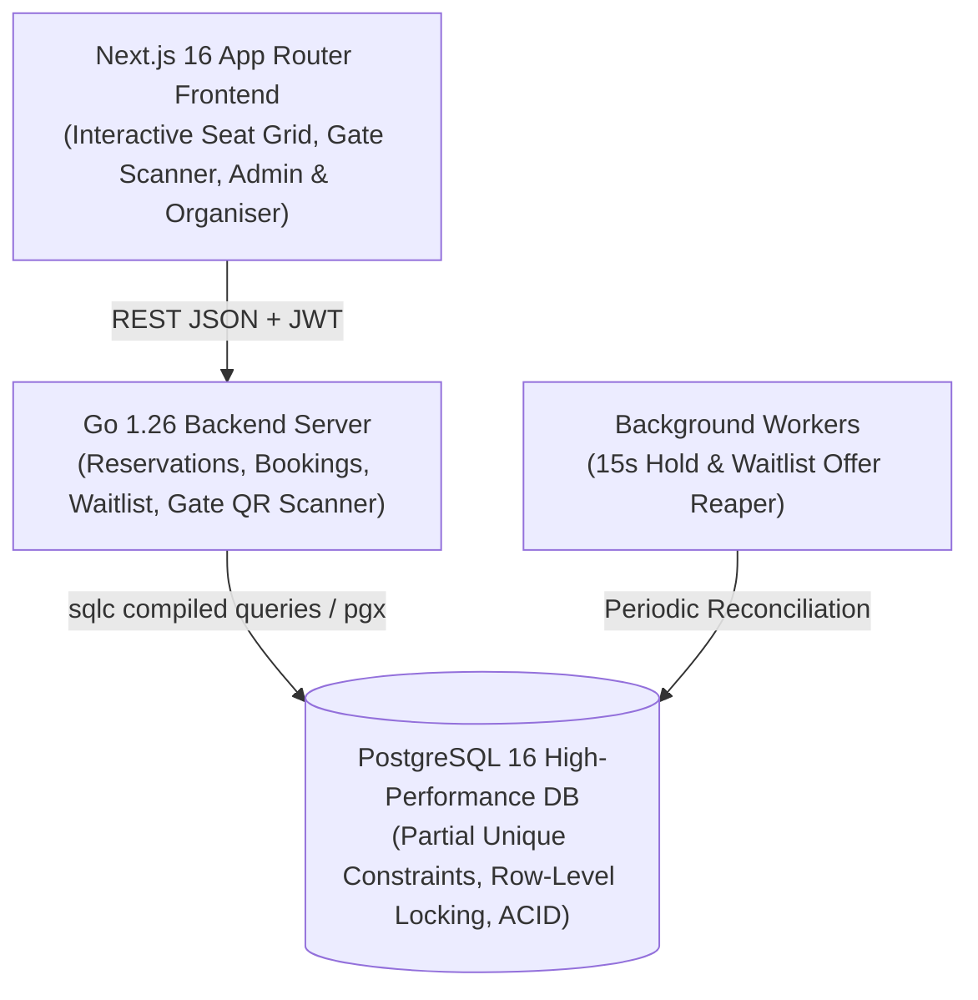
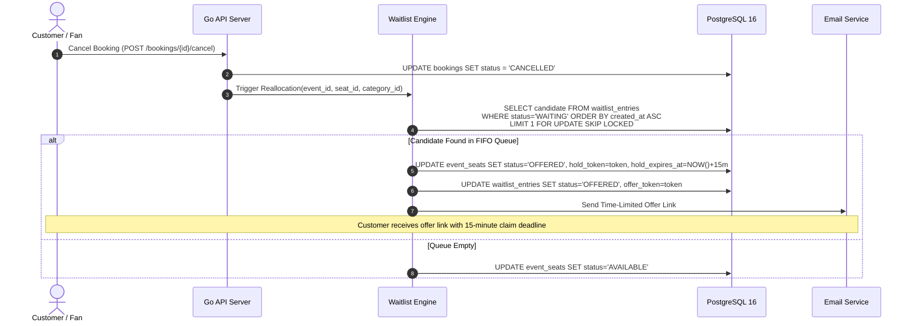

# VelvetSeats System Design & Concurrency Architecture

## 1. System Overview & Clean Architecture
VelvetSeats is a high-concurrency ticket booking and event management platform architected for data integrity, zero double-bookings, and deterministic FIFO waitlist reallocations.



The system is decomposed into decoupled domain modules (`venues`, `events`, `reservations`, `bookings`, `tickets`, `waitlist`, `email`, `qrcode`) communicating via strongly-typed repository contracts generated by `sqlc`.

---

## 2. Concurrency Safety & Double-Booking Prevention

Preventing race conditions where multiple fans attempt to reserve or purchase the exact same seat simultaneously is enforced at both the database and transactional layer:

### A. Partial Unique Index Enforcement
PostgreSQL partial unique indexes guarantee physical exclusion at the database engine level:
```sql
-- Guarantees a seat can only be actively booked once per event
CREATE UNIQUE INDEX uq_event_seat_booked 
ON event_seats (event_id, venue_seat_id) 
WHERE status = 'BOOKED';

-- Guarantees a seat cannot have overlapping active holds or pending offers
CREATE UNIQUE INDEX uq_event_seat_active_hold_offer 
ON event_seats (event_id, venue_seat_id) 
WHERE status IN ('HELD', 'OFFERED');
```

### B. Atomic Compare-And-Swap (CAS) Transitions
When a customer requests a hold on selected seats, the backend executes an atomic transition within a `SERIALIZABLE` or `READ COMMITTED` transaction:
```sql
UPDATE event_seats
SET status = 'HELD',
    hold_token = $hold_token,
    hold_expires_at = $expires_at,
    held_by_user_id = $user_id
WHERE event_id = $event_id
  AND id = ANY($seat_ids)
  AND status = 'AVAILABLE';
```
If the affected row count is less than the requested seat count, the transaction is rolled back immediately with HTTP `409 Conflict`, ensuring no partial reservations occur.

---

## 3. Seat Hold TTL & Automatic Expiration Engine

1. **Client-Facing Timer**: When a hold is acquired, a 10-minute (600s) TTL timestamp is attached. The frontend renders an interactive countdown bar.
2. **Checkout Validation**: During checkout (`POST /events/{id}/bookings/checkout`), the backend validates that `hold_expires_at > NOW()` and atomically flips the status from `HELD` to `BOOKED` within a single database transaction.
3. **Background Reaper Worker**: A background ticker running every 15 seconds invokes `BulkReleaseExpiredHolds`:
```sql
UPDATE event_seats
SET status = 'AVAILABLE',
    hold_token = NULL,
    hold_expires_at = NULL,
    held_by_user_id = NULL
WHERE status = 'HELD'
  AND hold_expires_at < NOW();
```
Released seats immediately become selectable on live event seat maps.

---

## 4. FIFO Waitlist Reallocation & Time-Limited Offers



### A. FIFO Queue Candidate Selection
Waitlist entries are selected strictly by creation time (`created_at ASC`) with row locking to eliminate race conditions between concurrent worker threads:
```sql
SELECT id, user_id, event_id, seat_category_id
FROM waitlist_entries
WHERE event_id = $1 
  AND seat_category_id = $2 
  AND status = 'WAITING'
ORDER BY created_at ASC
LIMIT 1
FOR UPDATE SKIP LOCKED;
```

### B. Cascading Offer Expiration
- Upon offer creation, a secure UUID `offer_token` is generated with `offer_expires_at = NOW() + 15 minutes`. The seat status transitions to `OFFERED`.
- If the customer confirms via `POST /waitlist/offers/{token}/accept`, their booking is created and tickets generated.
- If the offer window expires, the background worker invokes `ExpireStaleOffers`, marking the entry `EXPIRED` and immediately triggering `ReallocateCancelledSeat` to pass the seat to the next fan in queue.

---

## 5. Gate Ticket Verification & Anti-Replay Security

Each ticket pass contains a unique QR code payload composed of a cryptographic payload `TICKET|<ticket_uuid>|<booking_ref>|<hmac_sig>`.
At gate admission:
1. Turnstile scanner queries `POST /tickets/verify` for instant metadata inspection.
2. Operator triggers `POST /tickets/check-in`, executing an atomic state transition:
```sql
UPDATE tickets 
SET is_checked_in = TRUE, 
    checked_in_at = NOW() 
WHERE id = $1 
  AND is_checked_in = FALSE 
  AND status = 'VALID';
```
Any replay attack or double-scan returns HTTP `409 Conflict` ("Ticket Already Checked In") with the exact original timestamp and check-in gate operator ID.
